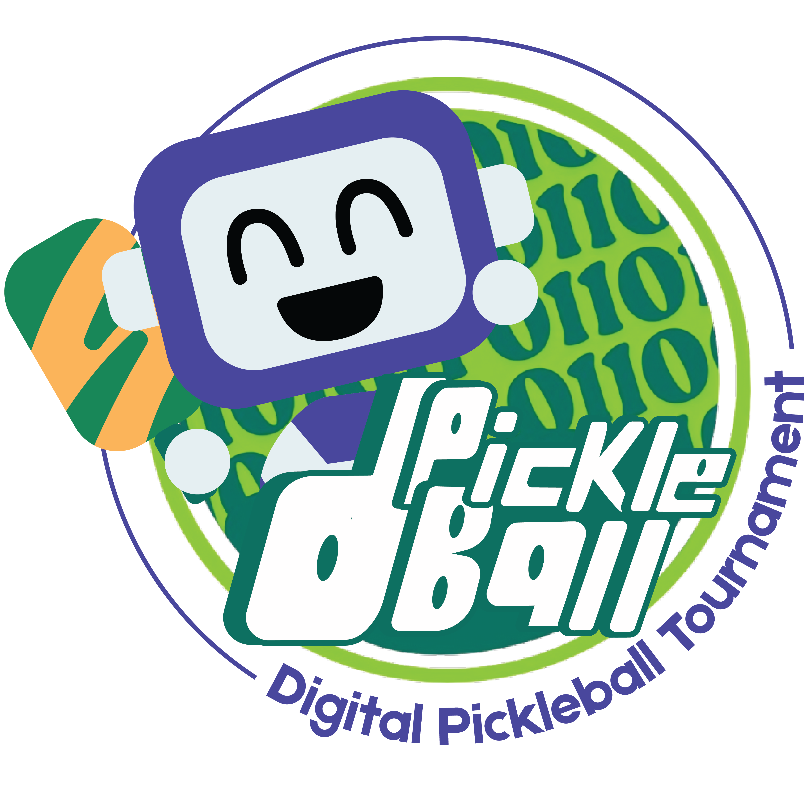
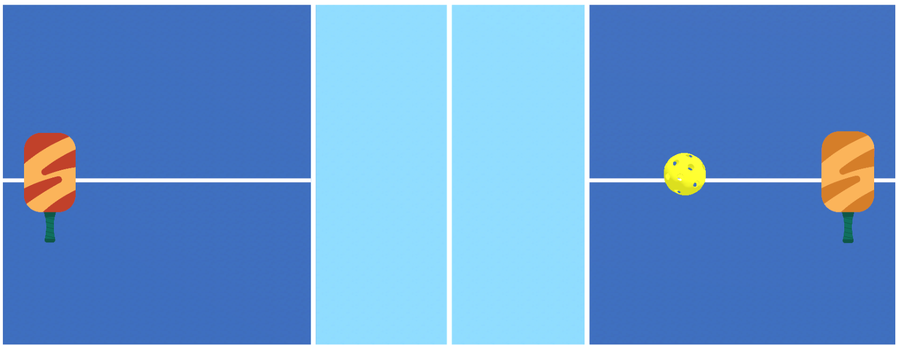

# BCI_Group
This repository provides the environment files and environment control code examples that the BCI group needs to use.


# dPickleBall Environment (https://github.com/dPickleball/BCI_env)



# Installation Steps to Set Up dPickleball Environment:

1) conda create -n dpickleball pip python=3.10.12
2) conda activate dpickleball
3) git clone https://github.com/dPickleball/dpickleball-ml-agents.git
4) cd dpickleball-ml-agents
5) pip install -e ./ml-agents-envs
6) pip install -e ./ml-agents
7) pip install matplotlib
8) pip install opencv-python==4.7.0.72
9) pip install pynput==1.8.1
10) pip install numpy==1.23.5
11) Download this repo, modify the path in test_paral.py

# Usage:
Build URL: [https://drive.google.com/drive/u/0/folders/1lFqj6lopoIO96C_IO8yGXGzRMY1S4fzi](https://drive.google.com/drive/folders/1lFqj6lopoIO96C_IO8yGXGzRMY1S4fzi)
1) Download the build from the URL above 
2) conda activate dpickleball
3) python test_paral.py    **(remember to change path and point to the build)**
4) python test_paral_keyboard.py    **(for keyboard control, remember to change path and point to the build)**
5) The environment will be launched and shown. **(Ctrl + C to exit)**


**HOW TO CONTROL THE GAME**
In order to send movement commands to the pickleball envirenment, you can refer to the control_unity.py. 
  The function you need to develop by yourself is read_commands: 
```python
try:
    while env.agents:
        count+=1
        left_cmds, right_cmds = read_commands()
        action_left = [0, 0, 0, 0]
        action_right = [0, 0, 0, 0]


```
Quite similar with that in the file test_paral_keyboard.py, the mapping rules are: 
*WSAD* means up, down, back, forward
*QE* means rotation_left, rotation_right
*IKJL* means up, down, back, forward
*UO* means rotation_left, rotation_right

```python
        #action_left
        if 'w' in left_cmds:
            action_left[0] = 1
        if 's' in left_cmds:
            action_left[0] = 2
        if 'd' in left_cmds:
            action_left[1] = 1
        if 'a' in left_cmds:
            action_left[1] = 2
        if 'e' in left_cmds:
            action_left[2] = 1
        if 'q' in left_cmds:
            action_left[2] = 2
        #action_right
        if 'i' in right_cmds:
            action_right[0] = 1
        if 'k' in right_cmds:
            action_right[0] = 2
        if 'l' in right_cmds:
            action_right[1] = 1
        if 'j' in right_cmds:
            action_right[1] = 2
        if 'o' in right_cmds:
            action_right[2] = 1
        if 'u' in right_cmds:
            action_right[2] = 2
        actions = {env.agents[0]: action_left, env.agents[1]: action_right}
        observation, reward, done, info = env.step(actions)
        reward_cum[0] += reward[env.agents[0]]
        reward_cum[1] += reward[env.agents[1]]
        if done[env.agents[0]] or done[env.agents[1]]:
            sys.exit()
        obs = observation[env.agents[0]]['observation'][0]
```

**SSVEP controller guidance**
The file ssvep_controller.py provided the basic reference to develop your controller.
The final layout of the controller is not limited, feel free to make your own adjustment.

set the position on flashing buttons
```python
    def button_offsets(radius):
        return {
            "up": (0, -radius),
            "down": (0, radius),
            "forward": (radius, -radius),
            "back": (-radius, radius),
            "turn_right": (radius, 0),
            "turn_left": (-radius, 0),
        }
```

set the frequency of blocks
```python
for name, _ in actions_block:
  ox, oy = offs[name]
  cx, cy = paddle1_pos1[0] + ox, paddle1_pos1[1] + oy
  rect = pygame.Rect(0, 0, size, size)
  rect.center = (cx, cy)
  f = max(0.1, float(freq_map[name])) # Hz
  phase = (now * f) % 1.0
  on = phase < 0.5
  bg = (255, 255, 255) if on else (30, 30, 30)
  fg = (10, 10, 10) if on else (230, 230, 230)
  pygame.draw.rect(screen, bg, rect, border_radius=10)
  pygame.draw.rect(screen, (200, 200, 200), rect, 2, border_radius=10)
  label = small_font.render(name, True, fg)
  lw, lh = label.get_size()
  screen.blit(label, (rect.centerx - lw // 2, rect.centery - lh // 2))
```
